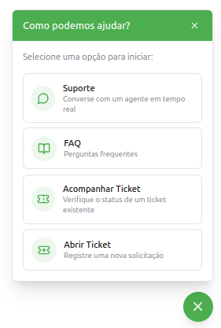
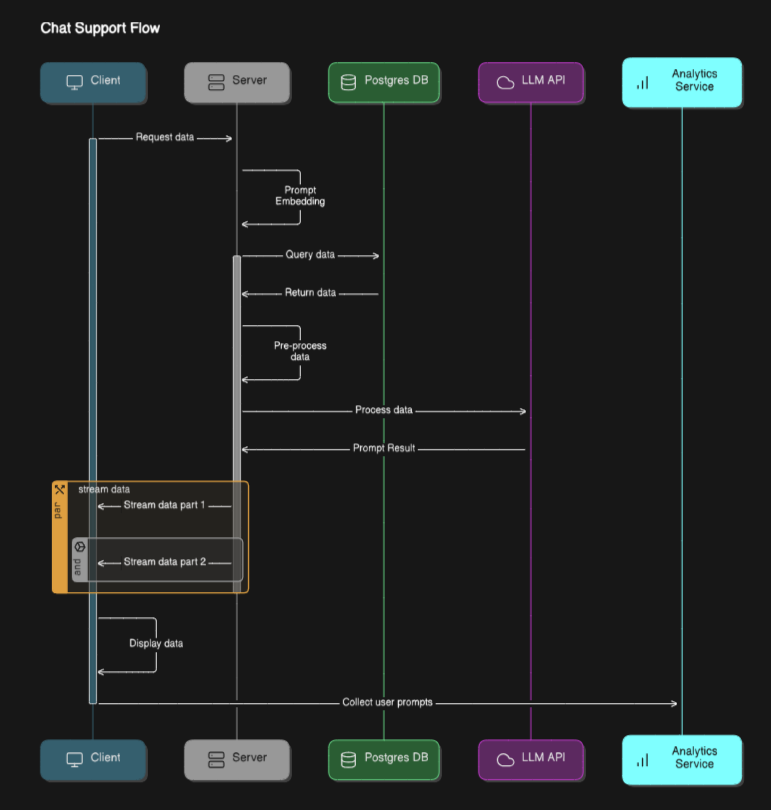
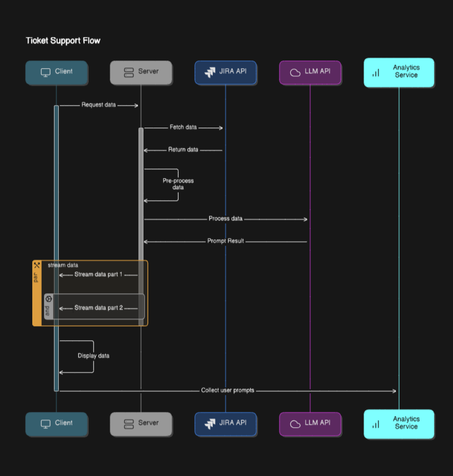

# Plano de Ação - GuaSuporte

## Objetivo

Este documento apresenta o plano de ação para o desenvolvimento do GuaSuporte, uma solução integrada de suporte com inteligência artificial (AI). O projeto visa otimizar a experiência do usuário ao oferecer um atendimento eficiente, automatizado e responsivo.

### Estimativas
Tempo de desenvolvimento entre 8-12 semanas para a primeira fase. Entre 4-8 para a segunda.

## Interface do Cliente

<em>Design meramente ilustrativo<em>

A interface será desenvolvida utilizando **LitJS**, garantindo um sistema leve, modular e de fácil manutenção. A comunicação em tempo real será feita utilizando **Server-Sent Events (SSE)** com servidores assincronos **Python aiohttp / Kotlin Ktor / Rust Warp**, permitindo atualizações dinâmicas e interações em tempo real.

## Tecnologias

- **LitJS** para construção da UI
- **Servidor Python aiohttp / Kotlin Ktor / Kotlin Vertx / Rust Warp** para orquestrar as requisições
- **Server-Sent Events (SSE)** para comunicação em tempo real
- **DeepSeek/ChatGpt/Outra API** para assistência automatizada
- **Qdrant ou Postgres Vector**: Banco de dados vetorial para armazenamento e indexação de dados vetoriais

## Features

- **Suporte**: Atendimento automatizado com AI, alimentado utilizando técnica de RAG e LLM APIs
- **FAQ**: Base de conhecimento construída e melhorada com base em analytics
- **Acompanhar Ticket**: Usuário pode perguntar sobre seu ticket para a AI, que utilizará a API do Jira para obter e fornecer atualizações
- **Abrir Ticket**: Interface intuitiva para criação de novas solicitações

## Suporte AI

O suporte utilizara dados que foram previalmente processados com técnicas de RAG e armazenados em um banco de dados vetorial. Esses dados serão utilizados para alimentar o modelo de IA, para responder às solicitações do usuário.

### Arquitetura

1 - Início da Solicitação (Cliente → Servidor)
O Cliente (interface do usuário) envia uma solicitação de suporte ao Servidor.

2 - Recuperação de Dados (Servidor → Banco de Dados)
- O servidor vectoriza o Prompt do usuário, transformando a solicitação em um formato adequado para consultar o banco de dados.
- O Servidor consulta o Banco de Dados para recuperar os dados armazenados.
- O Banco de Dados retorna os dados solicitados ao servidor.

3 - Processamento via API de LLM (Servidor → API de LLM)
- O Servidor envia o prompt e os dados recebidos do Banco de Dados como contexto
- A API de LLM gera uma resposta a partir do Prompt e do contexto fornecido, que é enviado de volta ao servidor.

4 - Transmissão de Dados de Volta ao Cliente (Servidor → Cliente)
- O servidor transmite os dados através de streaming para o cliente.
- O cliente recebe os dados transmitidos e os exibe para o usuário.

5 - Coleta de Análises (Cliente → Serviço de Análises)
- O cliente ou servidor, envia as solicitações dos usuários para ser armazenados no banco de dados, com o objetivo de analisar padrões de uso e melhorar a experiência do usuário.

## Acompanhamento de Ticket

### Arquitetura

1 - Início da Solicitação (Cliente → Servidor)
O Cliente (interface do usuário) envia uma solicitação de suporte ao Servidor.

2 - Recuperação de Dados (Servidor → Banco de Dados)
- O servidor vectoriza o Prompt do usuário, transformando a solicitação em um formato adequado para consultar o banco de dados.
- O Servidor consulta o Banco de Dados para recuperar os dados armazenados.
- O Banco de Dados retorna os dados solicitados ao servidor.

3 - Consulta na API do Jira
- O servidor vai consultar a API do Jira para obter informações sobre o ticket do cliente, com atenção especial para apenas obter informações relacionados com ticket dele.
- Essas informações serão encaminhadas para o servidor para alimentar o contexto da AI.

4 - Processamento via API de LLM (Servidor → API de LLM)
- O Servidor envia o prompt e os dados recebidos pelo Jira como contexto
- A API de LLM gera uma resposta a partir do Prompt e do contexto fornecido, que é enviado de volta ao servidor.

5 - Transmissão de Dados de Volta ao Cliente (Servidor → Cliente)
- O servidor transmite os dados através de streaming para o cliente.
- O cliente recebe os dados transmitidos e os exibe para o usuário.

6 - Coleta de Análises (Cliente → Serviço de Análises)
- O cliente ou servidor, envia as solicitações dos usuários para ser armazenados no banco de dados, com o objetivo de analisar padrões de uso e melhorar a experiência do usuário.

## Proximos Passos

### Dashboard para Análises e Configurações manuais
Apos o Chat estar no ar, com o objetivo de analisar os padrões de uso, acompanhar a usabilidade, e configurar parametros, precisamos de um dashboard para:

- Ajustar o system prompt para definir comportamento e estilo de resposta
- Definições de recursos a serem utilizados como contexto
- Historico de conversas
- Analise de perguntas
- Construção de FAQs

### Suporte ao Desenvolvedor

Uma copia simplificada da interface do chatgpt, com o objetivo de responder em formato de texto, perguntas relacionados a regra de negocio. Utiliza a mesma arquitetura do suporte ao cliente, sem a parte do analise de usabilidade, pois não sera necessario.
